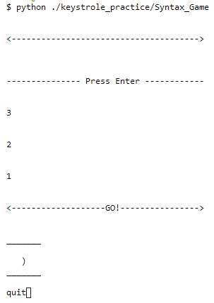

# Increase Your Code Syntax Speed

### Do you want to improve your Syntax Fingers?

## Game runs in your python terminal.
- Clear the terminal `clear`
- Run `cd ./keystrole_practice`
- python Syntax_Game
- Press up arrow to restart
- Beat your score.

- Designed to increase speed and efficiency when learning to program.
- Develop your strenght for touch common sytax characters

