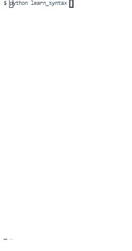
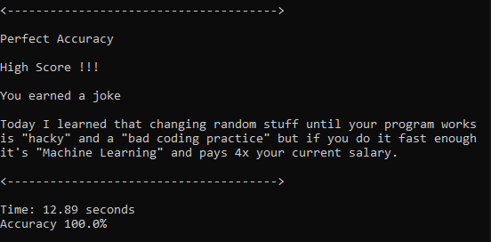

# Increase Your Coding Speed

## Do you want to improve syntax speed and accuracy?

This game is a way to warm up your fingers when starting to program.

Includes game modes for common syntax in `git`, `python`, and `pandas`

# Develop muscle memory for familiar characters

## Game runs in any Python terminal.

- Press Enter to start and progress ***or***
- Change game parameters, e.g. `python` or `20`

### How to win
- Type a copy of the syntax that you see and press `Enter`
- Type `quit` to exit
- Beat your score and unlock a joke with a high score

 

---

 Game by Dan Isaacman